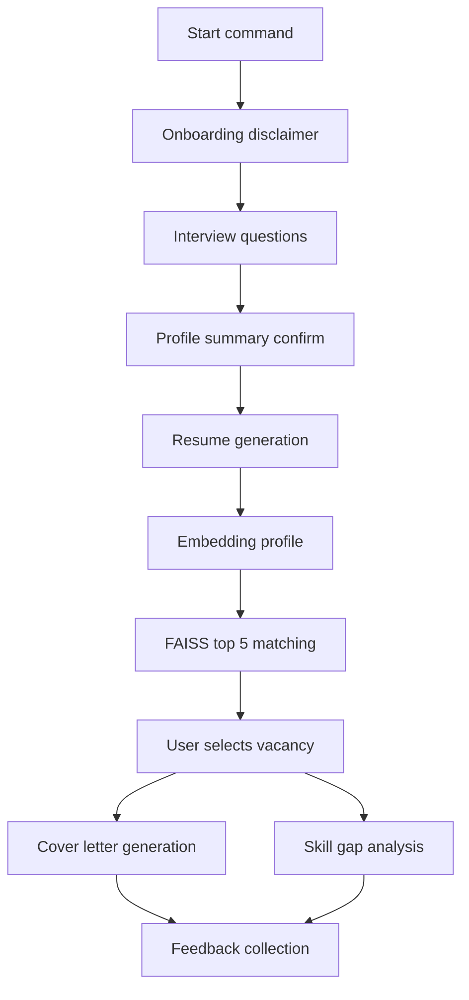

# MVP Implementation Plan: HR Career Assistant

Source: [`design_doc.md`](../design_doc.md)

## 1. MVP Scope and Acceptance Criteria

### In scope
- Telegram conversational interface for onboarding and interview
- FastAPI backend for orchestration and business logic
- Interview state machine with persisted session state
- Resume generation, cover letter generation, and skill-gap analysis
- Vacancy matching over mock vacancy dataset using embeddings + FAISS
- Local SQLite persistence for users, sessions, answers, artifacts, and feedback
- Local dockerized run for demo

### Out of scope for MVP
- Real HH production ingestion and scheduled incremental sync
- Grafana dashboards and full production observability stack
- Fine-tuning and advanced ranking models
- Hard scalability features beyond single-node local/demo run

### Acceptance criteria
- User can finish interview in Telegram and receive top-5 vacancies with match score
- User can generate resume and cover letter for selected vacancy
- User can receive explicit missing skills list and learning hints
- Main happy-path latency is acceptable for demo and failures return friendly fallback text
- All interactions and artifacts are persisted in SQLite for audit and iteration

## 2. Proposed Repository Structure

```text
.
├── app/
│   ├── api/
│   │   ├── routes_interview.py
│   │   ├── routes_generation.py
│   │   ├── routes_matching.py
│   │   └── routes_health.py
│   ├── bot/
│   │   ├── telegram_app.py
│   │   ├── handlers_start.py
│   │   ├── handlers_interview.py
│   │   └── handlers_actions.py
│   ├── core/
│   │   ├── config.py
│   │   ├── logging.py
│   │   └── errors.py
│   ├── domain/
│   │   ├── models.py
│   │   ├── interview_fsm.py
│   │   └── prompts.py
│   ├── services/
│   │   ├── llm_service.py
│   │   ├── embedding_service.py
│   │   ├── matching_service.py
│   │   ├── profile_service.py
│   │   └── vacancy_service.py
│   ├── storage/
│   │   ├── db.py
│   │   ├── repositories.py
│   │   └── faiss_index.py
│   └── main.py
├── data/
│   ├── mock_vacancies.json
│   └── faiss/
├── tests/
│   ├── unit/
│   ├── integration/
│   └── fixtures/
├── scripts/
│   └── build_index.py
├── .env.example
├── requirements.txt
├── Dockerfile
├── docker-compose.yml
└── README.md
```

## 3. End-to-End User Flow and State Machine

### Dialogue flow
1. `/start` → consent and AI disclaimer
2. onboarding summary of capabilities
3. interview questions in Russian, one-by-one
4. confirm summary profile
5. generate resume draft
6. match vacancies and return top-5 with buttons
7. choose vacancy
8. generate cover letter
9. generate skill-gap analysis
10. collect feedback thumbs up/down

### Interview states
- `NEW`
- `ONBOARDING`
- `INTERVIEW_Q1...Qn`
- `PROFILE_REVIEW`
- `RESUME_READY`
- `MATCHING_READY`
- `VACANCY_SELECTED`
- `COVER_READY`
- `GAPS_READY`
- `COMPLETED`
- `ERROR_RECOVERABLE`



## 4. API and Internal Contracts

### Public backend endpoints
- `POST /v1/interview/start`
- `POST /v1/interview/answer`
- `GET /v1/interview/state/{user_id}`
- `POST /v1/generate/resume`
- `POST /v1/match/vacancies`
- `POST /v1/generate/cover-letter`
- `POST /v1/generate/skill-gaps`
- `POST /v1/feedback`
- `GET /healthz`

### Internal service boundaries
- bot layer: Telegram update parsing and button routing
- orchestration layer: session transitions and idempotent command handling
- generation layer: LLM prompts with validation and fallback templates
- matching layer: embedding + FAISS retrieval + score normalization
- persistence layer: sqlite repositories and structured logs

## 5. Data Design

### Mock vacancies format
- file: `data/mock_vacancies.json`
- fields: `id`, `title`, `company`, `description`, `skills`, `salary_from`, `salary_to`, `location`, `url`, `posted_date`, `active_flg`
- dataset target for MVP: 300 to 1000 records

### SQLite schema entities
- `users`
- `sessions`
- `interview_answers`
- `profiles`
- `vacancies`
- `recommendations`
- `generated_artifacts`
- `feedback`
- `event_logs`

## 6. Matching and Generation Strategy

### Embedding and retrieval
- single embedding model for both user profile and vacancy text
- concatenate normalized profile fields into one retrieval text
- FAISS cosine-like similarity using normalized vectors
- fallback: lexical keyword match if embedding service fails

### Prompt set
- resume prompt with strict no-hallucination constraints
- cover letter prompt bounded to vacancy context + user profile
- skill-gap prompt returning missing skills, priority, and learning resources
- all prompts versioned in code and stored with generated artifact metadata

### Guardrails
- sanitize user input and cap max text size
- enforce Russian response style for user-facing output
- if LLM timeout or invalid response: deterministic template fallback

## 7. Config, Security, and Runtime

### Environment configuration
- Telegram token
- LLM API key and model name
- embedding model name
- sqlite path
- faiss index path
- feature flags for mock llm and fallback modes

### Security basics for MVP
- no sensitive IDs requested from user
- basic request validation and output escaping
- local-only sqlite with rotation backup for demo

## 8. Test Strategy

### Unit tests
- interview state transitions
- profile text composition
- prompt rendering and response parser
- matching score normalization

### Integration tests
- API flow from start interview to generation
- sqlite persistence checks
- FAISS index build and retrieval checks

### Deterministic tests
- mock LLM adapter returning fixed payloads for stable CI

## 9. Docker and Demo Operations

### Local demo stack
- backend service container
- optional bot process container
- volume mounts for sqlite and faiss data

### Run sequence
1. install dependencies
2. build mock vacancy embeddings and faiss index
3. run backend and bot
4. run smoke tests and demo scenario

## 10. File-Level Backlog for Code Mode

### Priority order updated
Backend APIs and matching are implemented before Telegram handlers.

1. Scaffold project layout and dependency manifests
2. Implement config and logging core
3. Implement sqlite models and repositories
4. Add mock dataset and indexing script
5. Implement embedding service and FAISS adapter
6. Implement matching service and recommendation formatter
7. Implement interview FSM and profile composer
8. Implement LLM service with resume, cover, and gap generators
9. Implement FastAPI routes and request/response schemas
10. Add backend-focused unit and integration tests with mock LLM
11. Implement Telegram bot handlers and action callbacks
12. Add Docker artifacts and README runbook

## 11. Definition of Done for MVP

- Demo script executes full happy path in Telegram
- Generated resume, cover letter, and skill gaps are persisted and retrievable
- Top-5 vacancy recommendations shown with stable score ordering
- Test suite passes locally
- Docker-based local launch instructions are reproducible
